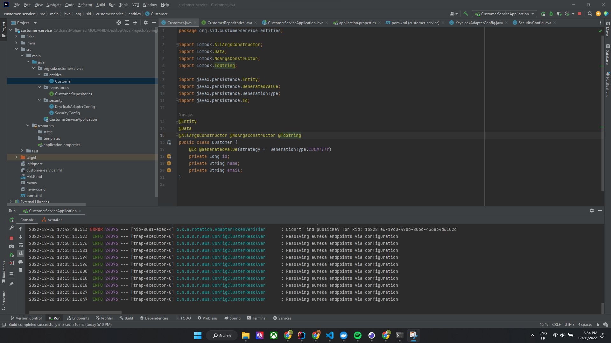
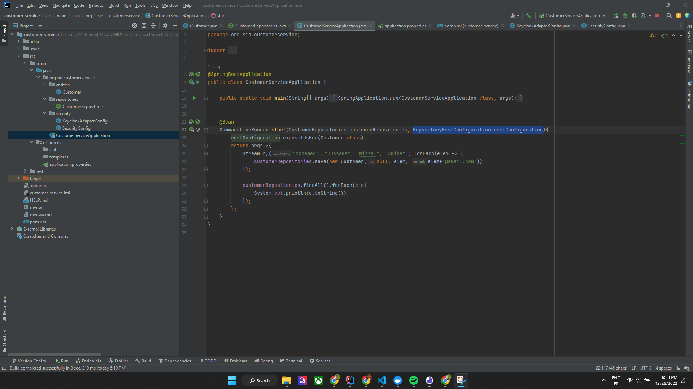
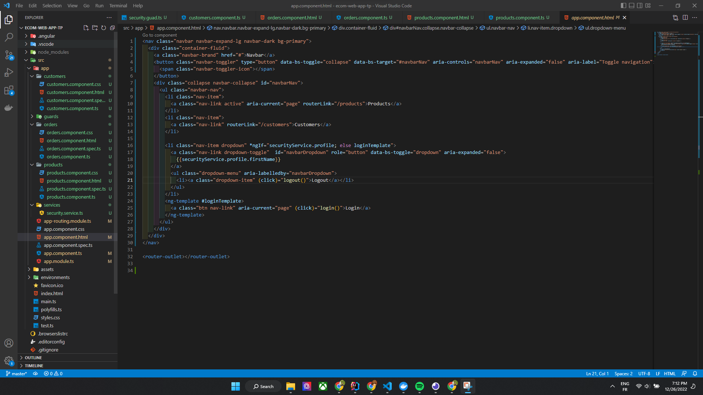
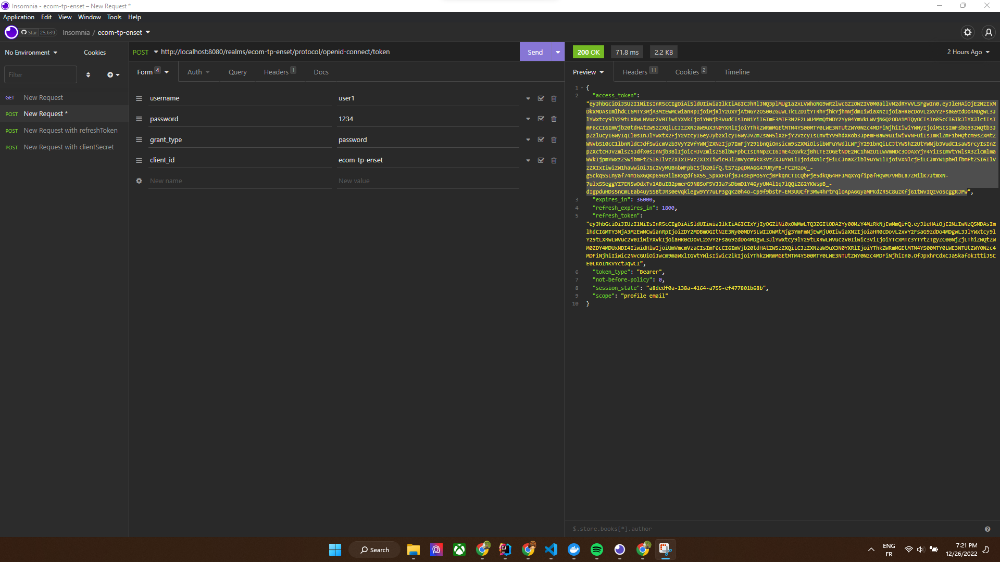

<h1 >Activité Pratique de synthèse (microservices with springboot,springcloud,... | security with keycloak | FrontEnd with ANGULAR)</h3>

<h3 style="color:red" >1.Créer le micro-service customer-service qui permet de gérer les client</h3>
    
    
    

<h3 style="color:red">2.Créer le micro-service inventory-service qui permet de gérer les produits<h3 style="color:red">
    
    
    

<h3 style="color:red">3. Créer la Gateway Spring cloud Gateway</h3>
    
    

<h3 style="color:red">4. Configuration statique du système de routage</h3>
    
    

<h3 style="color:red">5. Créer l'annuaire Eureka Discrovery Service</h3>
    
    
<h3 style="color:red">6. Faire une configuration dynamique des routes de la gateway</h3>
    

<h3 style="color:red">7. Créer le service de facturation Billing-Service en utilisant Open Feign</h3>
    
    
    
    
    
    
    
    

<h3 style="color:red">8. Créer un client Web Angular (Clients, Produits, Factures)</h3>
    
    
    
    
    
    
    
    
    
    
    
    

<h3 style="color:green">9. Déployer le serveur keycloak :</h3>
       
     <h3 style="color:green">- Créer un Realm</h3>  
       
     <h3 style="color:green">- Créer un client à sécuriser</h3>
            
     <h3 style="color:green">- Créer des utilisateurs</h3>
            
     <h3 style="color:green">- Créer des rôles</h3>
            
     <h3 style="color:green">- Affecter les rôles aux utilisateurs</h3>
            
            
     <h3 style="color:green">- Tester les différents modes d'authentification avec Postman en montrant les contenus de Access-Token, Refresh Token </h3>
            
            
            

<h3 style="color:red">9. Sécuriser les micro-services et le frontend angular en déployant les adaptateurs Keycloak</h3>
            
            
            
            
            
            
            
            
   
<h3> Réalisé par : <bold>Mohamed MOUJAHID</bold></h3>